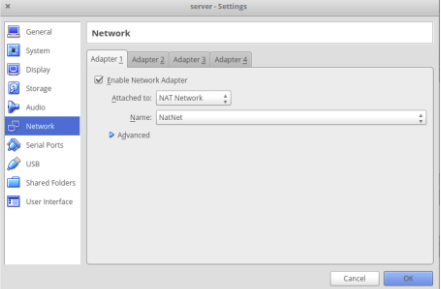

Nat Network
===========
.. image:: nat1.png

Setting up a new Nat network
++++++++++++++++++++++++++++

After clicking on file, click on preferences
--------------------------------------------
.. image:: nat2.png

Click on Network
----------------
.. image:: nat3.png

Click on plus sign on the right hand side of the window, it will a new "NatNetwork".
------------------------------------------------------------------------------------

.. image:: nat4.png

Double click on "NatNetwork" &
------------------------------ 

* update the following : 
   *  set the network name "hadoop"
   * set network CIDR: "192.168.200.0/24"

.. image:: nat5.png

Click on plus i.e on the right hand side of the window to set the port forwarding rules.
----------------------------------------------------------------------------------------
.. image:: nat6.png

Set a new rule name 'ssh' set  the following variables
------------------------------------------------------
    #. Host IP : 0.0.0.0
    #. Default Hostport : 20022
    #. Guest IP: 192.168.200.10
    #. Guest Port : 22

.. image:: nat7.png

Afte clicking on settings choose Network, now choose from Birdge Adapter to NatNetwork and select the name according to your connection, in this case `hadoop`.
-----------------------------------------------------------------------------------------------------------------------------------------------------------------

Send files over NatNetwork using the following `rsync` command

.. code-block:: bash
    
    hadoop@~ rsync -avz "ssh -p $portnumber" /local_path_to_file user@remoteip: /destination_directory

